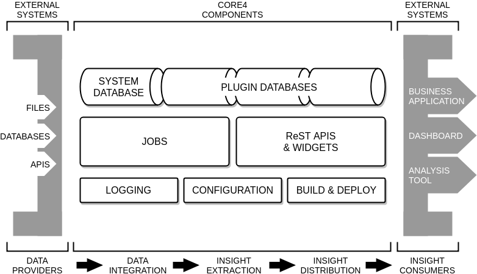

############
introduction
############

core4 delivers a unified platform from data integration, through insight
extration to insight distribution.

The following diagram provides an overview of the main core4 components
embedded in an ecosystem of external data providers and external insight
consumers.

As a framework, core4 facilitates the day-to-day tasks of a data scientist:

#. to work with and **integrate data** from various data sources in a vast
   variety of formats
#. to work with and **connect state of the art analysis tools**, machine
   learning libraries and software packages, i.e. Pandas, Tensorflow and R
#. to **distribute results** with simple (and sometimes not so simple)
   business applications and dashboarding systems
#. to **automate and productionise** these activities
#. to be **flexible**, **scalable** and **secure** at all stages of the
   workflow

feature summary
===============

The main objective of a data scientist is to deliver insights. core4 aims to
support the data scientist in managing structured and unstructured data,
workflow automation, distributed computation, and to provide data and insight
access to other systems and users fast, right, cheap and easy.

* core4 is implemented with **Python 3**, the de-facto standard programming
  language of data scientists as of today
* core4 provides connectors to **R**, the number one go-to tool for data
  exploration, machine learning and statistical analysis (see :doc:`R`)
* core4 features the NoSQL **MongoDB** to handle structured,
  semi-structured and unstructured data at scale (see :doc:`data`)
* core4 delivers a simple **plugin architecture** to encapsulate different
  business domains, accounts or tenants (see :doc:`plugin`)
* core4 features a simple model to **automate, monitor and control jobs** at
  scale (see :doc:`job`, :doc:`parallel` and :doc:`logging`)
* core4 integrates a **ReST API** system based on Python Flask-Restful to
  provide access to data and insights to other users and external systems in a
  simple, reliable and secure manner (see :doc:`api`)
* core4 ReST API easily extends into **mini web applications** (widgets) using
  the Python flask and werkzeug packages
* core4 ships with an integrated **configuration system** to support core4
  operations of jobs and ReST APIs (see :doc:`config`)
* core4 simplifies **rollout and deployment** of new and updated jobs and ReST
  APIs (see :doc:`rollout`)
* core4 ships with a simple, yet flexible **authentication and authorisation**
  system to manage access to all data and API resources (see :doc:`access`)
