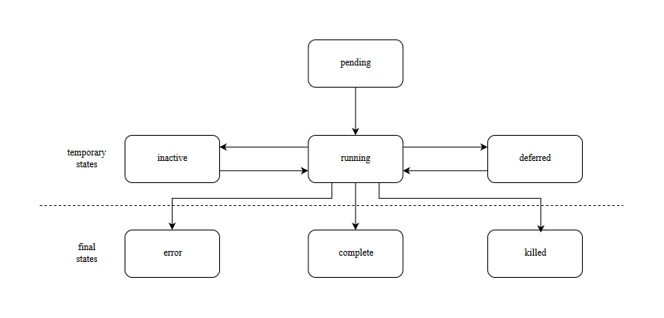

.. _job:

CoreJob
=======

Introduction
------------

As of today, modern Data-Scientists use a variety of python- and R-modules both Open- and Closed-Source to create
relevant insights based on multiple sets of data from many different sources.

Core4-Jobs are for those Data-Scientists and -Engieneers to achive fault-tolerant automatization of all
needed steps of creating those insights without having the user think about the underlying software or hardware.

core4 takes care of everything that is essential to using and operating such a distributed system,
from central logging and configuration to deployment, all this while scaling to the 100ths of servers.

todo: first small example....

A job can have multiple states, depending on its configured runtime-behaviour:

Jobs are guided via config- or class-variables,
A most basic subset of these settings are descriped in the table below:

 ================= ====================================================================
          property description
 ================= ====================================================================
              args arguments passed to the job
            author author of the job
             chain jobs that are to launch after the current job finishes
         defer_max overall Sum of seconds a job can be deferred
        defer_time time inbetween defers
        dependency dependencies that have to be finished before the job can be launched
        error_time seconds to wait before a job is restarted after a failure
             force ignore available ressources, force start a job
      max_parallel max. number of parallel running jobs of current type
             nodes nodes the job can run on
          priority priority with 0 being the lowest
          schedule job schedule in crontab-syntax
             state current state of the job (see the graphic above)
         wall_time seconds before a job with no feedback turns to zombie.
 ================= ====================================================================

For further information about possible arguments please visit: :ref:`configuration management <config>`.

More examples are provided below.
If you feel curious about implementing your own Job, we'd recommend you to benefit from our experience and have a
look on the best-practices section before: .._:ref:`best-practices currently still below`

Examples
--------

-- code --

Principles
----------

CoreJobs implement the logic layer of the core architecture. Jobs can
broadly be categorised into

CoreJobs can be broadly categorised into:

-   extraction jobs, scanners and feed readers representing inbound
    interfaces

-   load jobs for saving inbound data to the database

-   transformation, analysis and aggregation job

-   export jobs and feeds representing the outbound interfaces

This differentiation is only from a conceptional view point. All jobs
are irrespective of their goal and purpose implemented as CoreJobs.

Best practices
--------------

When writing CoreJobs (or any part of software really), it is advisable
to adhere to the following design paradigms:

-   **divide and conquer**

        divide a big task into multiple smaller parts. The smaller the Task, the easier to scope, to maintain and to
        follow along for others. It also encourages you to follow the next point made here:

-   **do one thing and do it well**

        Do not try to: "I'll fix everything in one method". Seperate logical building-blocks from your code, every
        block should only do one single task. This makes it easier to implement changes in the future and helps your
        code to be more readble.

-   **KISS - keep it simple and stupid**
        Robustness and maintainability are more precious than saving a few seconds of time. This however is not valid
        for the correctness of an algorithm. Aim your complexity as high as it has to be but as low as it needs to be.

Both guidelines are interrelated. The dotadiw (do one thing and do it
well) philosophy is borrowed from the general Unix philosophies.
Actually, the design of automation jobs should follow the first four out
of nine guidelines:

-   **Small is beautiful**
        The less code, the easier it is for someone else to understand it, even if that someone is your future self.

-   **Make each program do one thing well**
        do not mix several steps of a processing chain into one document.
        Seperate in e.g. load-Job, transform-Job and report-Job.

-   **Build a prototype as soon as possible**
        if you do start programming, try reaching the state of a working prototype as soon as possible. This way,
        you'll notice errors in your concept wail earlier, stumble open flaws in your design and you will speed up your
        overall developing speed.

-   **Choose portability over efficiency**
        The more independent your code is from environmental-specific changes, the more robust it will be.
        If you set e.g. set low timeouts, the job may unnecessarily fail when running on high-load nodes.

Out of experience we would recommend to adhere to the following
principles also:

-   **design your applications with restartability in mind**
        There are multiple reasons why a job might fail, including only temporary failures (imagine a website you crawl
        being in maintenance). You can safe yourself a lot of hastle if the job itself knows about its state and can
        simply be restarted without being worried about data-loss or crashing dependencies.

-   **create Data-Structures that are idempotent on multiple loads of the same data**
        you may find yourself in the position where you do not know whether a certain job has processed a particular set
        of data or not. It is elegant to just be able to enqueue that particular job that either only updates the data
        if changes are detected or simply updates allready present documents. That way you do not have to worry about
        overwriting critical output.

-   **implement continuity-checks if data is continuous**
        even if your jobs always run to perfection, some of your clients may not. If you have a continuous data stream
        (e.g. a daily reporting via excel) always check that data for completness. It is easier to let a job fail if
        expected data is not present than to try to retrospectively fix a processing-chain.

-   **robustness before neatness**
        python offers some really nice features for writing clean and easy-to-understand code. An experienced programmer
        might feel tempted to implement the fastest, most effecient way for doing some kind of task. However, speed
        alone should not always be the sole goal of software-design. Keep in mind that many more people might be reliant
        on working on and understanding your code, this even includes your future self.

-   **work silently, fail noisily**
        if your job runs without error, there is no need to log. If however an error occurs, expect to need as much
        information as possible to fix it. Core4 enables you to do this by only logging DEBUG-messages in case of an
        error, but still, you are the one that has to implement these messages.

-   **build modular and reusable classes and functions**
        there always will be multiple parts of a programm that can be reused somewhere else. Rather than duplicating
        that code on every place it is needed, simply uncouple the part that is often reused. Not only will your code
        look more clean, you also do save yourself a lot of time if you need to enhance or fix that particular part of
        code.

-   **choose meaningful function-/class-/variable-names**
        choosing simple, yet descriptive names will greatly help you maintain or extend your code.

