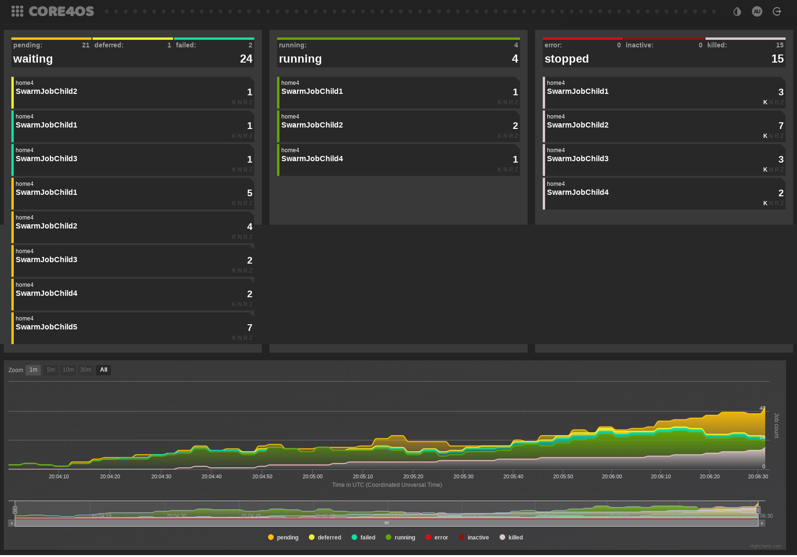

===========
why core4os
===========

core4 utilises Python, the main reason for that choice is that python is the de
facto standard for Business Intelligence and Data Driven Applications. Below
you'll find four usual applications for core4 and why core4 is a good choice in
each of them.

data engieering perspective
===========================

core4 is the perfect tool for your everyday Data Engineering requirements and
needs.

core4 uses Python as its core, this allows for an easy and fast way of getting
started, due to the accessibility offered by pythons expansive ecosystem and
resources.

It gives you easy to use, but powerful Configuration options, so you can
customize it for every conceivable use case. We use YAML for our configs, this
makes them easy to read while still maintaining a high level of readability.

core4 enables you to painlessly automate and schedule your work, so you have to
spend less time manually executing them or fiddling with other more complex
ways of automation. Let core4 do the work for you.

Another big selling point of why you should use core4 is the effortlessness with
which you can execute your jobs distributed, unlike other solutions there is
almost no overhead required and you don’t need to micromanage every node in
your cluster, but if that’s one of your past time activities, don’t worry, if
you really want to you can still do that to your heart's content.

This all is rounded up by arguably one of the most important parts: The
controlling and monitoring. core4 allows you to log the things you’re interested
in, on varying levels, depending on what you need in given the moment, from
helpful general information when the jobs are progressing smoothly to
everything down to lowest level, including debug messages, when a job failed.

data science perpective
=======================

core4 enables Data Scientists to work more efficiently and to get their needed
insights faster.

core4 supports the flexibility required for a Data Analyst to get their analyses
done more quickly, this is because core4 is built on Python, an already well
established programming language in the Data Scientist space, this grants
access to a huge eco system of existing libraries, which all have the common
goal of making your life easier.

Because we use Python as a foundation and all the perks that come with it,
core4 is familiar to work with and it’s just as easy to get started with as if
it were another python library. With that in mind, we also built core4 on the
principles of REPL to allow for a already familiar and iterative workflow to
Data Scientists.

Another point why you should consider core4 as your new go-to tool for your
daily work are the built in R-Jobs, so it’s even easier to use your existing
work you’ve already done in R and port it over to core4, so it can run on
hardware that is able to scale to your demands rather than you relying on your
local machine.

core4 is highly scalable and can support multiple distributed machines, this
enables you to work with Big Data with which you were unable to work with
before because of the limitations of your local hardware.

This and more is in summary what core4 offers you, this all comes with a
relatively low technical hurdle, you don’t have to have a deep technical
understanding about the inner workings of a distributed system to get the most
out of core4.

business user and application perspective
=========================================

core4 allows business of any size to build and deploy all kinds of applications
fast and hassle free.

Because core4 with all of its features enables you to perfectly integrate your
agile method of operating into the developing cycle with that it's possible to
employ rapid prototyping for you to get tangible results faster.

With the ReST capabilities, tornado and Front End Tool integration that core4
offers it's easy to make your data available for other applications. Due to the
nature of core4 it is unifying Data Science and Business Intelligence into one
cohesive framwork.

A big reason of why you should choose core4 is the ease of how it enables you to
work more efficient and get results faster and can in turn help to improve your
product faster.

system architect perspective
============================

As business intelligence evangelists we believe in KAIZEN and the philosophy of
continuous improvement. Today most if not all industries have an urgent need
for constant change. Change is the new normal. As business intelligence experts
our commitment therefore is to deliver the right tools, helpers, applications
and gadgets supporting this constant change: fast, right, cheap and easy.

In a nutshell this means: implement and deliver applications on the moving
belt.

To manage this demand as well as the thoroughly complex workflow from design
through implementation to roll-out not a single but rather a multiple of
different applications three ingredients are essential:

#. a mindset and tactics to follow the KISS principle
#. an agile product development platform and runtime environment
#. a central point to grant and provide user access to the different tools.

KISS is the general engineering principle to “keep it simple, stupid”. We break
down this principle into the following design concepts for software
development borrowed from the Linux Philosophy.

#. Do one thing and do it right. To build a new job, build afresh rather than
   complicate old programs by adding new "features".
#. Write programs that work together.
#. Design and build early prototypes ideally within days or weeks. Don't
   hesitate to throw away the clumsy parts and rebuild them.

core4 is the agile architecture. It is designed with agile processes in mind to
implement, reuse, simply deploy and efficiently operate automated jobs,
application programming interfaces and web front-ends.

core4 features jobs supporting the data engineer and data scientist to automate
data integration tasks, analysis and insight extraction tasks. The developer is
supported with a straight-forward configuration system, a central logging,
easy scheduling and state control among other tools and helpers to operate jobs
in a distributed environment and at scale (see :doc:'job`).

core4 features a HTTP based API with a simple authentication and access
management scheme to connect digested data to users and other systems. Similar
to jobs the provided request handler base classes support the developer with
configuration management, central logging, pagination among other helpers and
tools based on the Python ecosystem with tornado.

core4 jobs and APIs are managed with two simple support tools (see
:doc:`tools`) for release management, deployment and operations. All this to
deliver automation and insight delivery at scale. Very often the reality is
that a lot of us actually do see the value of achieving short-term goals,
preferring ease-of-use over correctness. core4 has been built to represent
a guardrail, provide best practices and guidance to keep things together even
with mid to large team sizes.

As a logical connsequence some web applications are shipped with core4. This is
**comoco**, the core4 job monitoring and control tool.

Furthermore there is the widget manager as central go-to place to search,
find, spawn, explore, understand and operate all automated jobs, application
programming interfaces (API) and applications by itself.

.. figure:: _static/widget_mgr.png
   :scale: 65%
   :alt: core4 widget manager

A widget is a relatively simple and easy-to-use software application or
component in contrast with a more complex application. And the widget manager
supports all users interacting with core4 jobs, APIs and web applications to
get things done.

conclusion
==========

core4 is simple to use and enables collaboration between Teams of Data
Scientists, Data Engineers and Business Users.

It allows for surface level knowledge, but offers the ability to dive deep into
the technical framework.

And it is very extensible because of the use of python.
